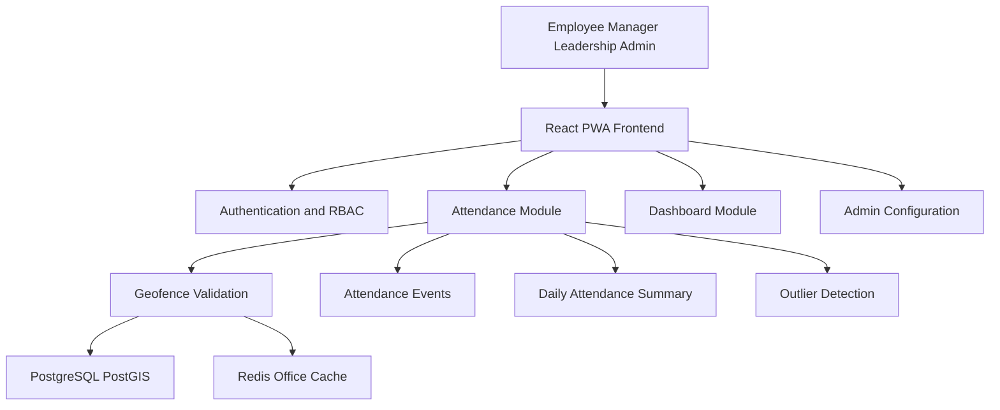
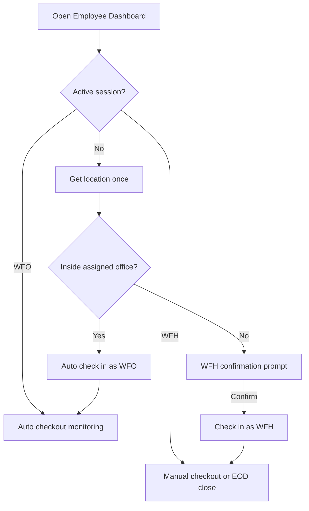

# WFH/WFO Attendance Tracking System

A responsive web/PWA application that tracks employee **Work From Office (WFO)** and **Work From Home (WFH)** attendance using geo-fencing. The system supports **Employee**, **Manager**, **Leadership**, and **Admin** roles with role-specific dashboards, daily attendance summaries, session/event history, and rule-based outlier detection.

Built as a **modular monolith** (Spring Boot + React) with PostgreSQL/PostGIS, Redis caching, transactional outbox processing, and Docker Compose for one-command local evaluation.

---

## Project Overview

The WFH/WFO Attendance Tracking System validates employee presence against an **assigned office geofence** to classify attendance. In MVP, each employee has **one assigned office**. Location is used purposefully:

- **Before check-in:** one browser location read decides auto WFO vs WFH confirmation.
- **After WFO check-in:** limited geofence monitoring supports auto-checkout only.
- **During WFH sessions:** no continuous location tracking.

Final daily attendance mode is **WFO or WFH only** (no HYBRID). Two concepts are stored separately:

- **Session mode** — WFO/WFH per check-in session, decided by backend geofence validation.
- **Daily attendance mode** — final WFO/WFH for the day in `attendance_records`, based on `total_office_minutes` from WFO sessions only.

Times are stored in **UTC** and displayed in the **browser local timezone** (e.g. IST for users in India).

---

## Key Features

| Area | Features |
|------|----------|
| **Attendance** | Auto WFO check-in, WFH confirmation prompt, manual check-in/out, same-day re-check-in, WFO auto-checkout monitoring |
| **Geo-fencing** | PostGIS geofence validation against assigned office; Redis-cached office lookup |
| **Summaries** | Daily `attendance_records` with final WFO/WFH mode and office minutes |
| **Sessions** | Per check-in session mode (WFO/WFH) in `attendance_sessions` and `attendance_events` |
| **History** | Full `attendance_events` and `attendance_sessions` audit trail |
| **Dashboards** | Employee, Manager, Leadership role-specific views |
| **Admin** | Employee, office location, and attendance policy management |
| **Outliers** | Rule-based anomaly detection (late, absence, missing checkout, low WFO, repeated EOD close) |
| **Notifications** | In-app alerts for managers and employees |
| **Async processing** | Transactional outbox + scheduled jobs for classification, outliers, cache refresh |
| **API docs** | Swagger/OpenAPI with paginated list APIs |

---

## Tech Stack

| Layer | Technologies |
|-------|--------------|
| Backend | Java 17, Spring Boot 3.x, Spring Security (JWT), JPA, Flyway |
| Frontend | React, Vite, React Router, Axios, Recharts, PWA-ready |
| Database | PostgreSQL 16 + PostGIS |
| Cache / locks | Redis, Redisson |
| API docs | Springdoc OpenAPI / Swagger UI |
| Deployment | Docker Compose |

---

## Architecture Summary

```
React PWA  ──HTTPS/JWT──►  Spring Boot Modular Monolith
                                    │
                    ┌───────────────┼───────────────┐
                    ▼               ▼               ▼
              PostgreSQL         Redis          Outbox + Schedulers
              + PostGIS       (cache/locks)    (async side effects only)
```

| Component | Role |
|-----------|------|
| **PostgreSQL/PostGIS** | Source of truth — employees, offices, attendance sessions, events, daily summaries |
| **Redis** | Assigned office cache, optional today attendance cache, auto-tracking state, dashboard cache, distributed locks |
| **Attendance Module** | Directly saves `attendance_events`, `attendance_sessions`, `attendance_records` |
| **Outbox poller** | Async side effects only — classification, outlier detection, notifications, cache refresh |
| **Day-close scheduler** | EOD system close for open sessions at 23:59:59 |

The **DB is the source of truth** for active attendance sessions. Redis caches are optional performance layers.

See [docs/architecture.md](docs/architecture.md) for the full architecture diagram and module breakdown.

---

## Diagrams

### Project scope (high level)



### Employee attendance flow (summary)



Detailed flow: [docs/attendance-flow.md](docs/attendance-flow.md)

---

## Final Attendance Flow

### Before check-in

1. Employee opens the dashboard (or returns after checkout).
2. App calls `getCurrentPosition()` **once** and sends location to the backend.
3. **Inside** assigned office geofence → auto **WFO** check-in after ~15s stability (demo).
4. **Outside** assigned office geofence → **WFH confirmation prompt** (WFH is never silently marked).
5. Manual check-in remains available; backend classifies WFO/WFH from geofence.

### Active WFO session

- UI: *Checked in as WFO* + *Auto-checkout monitoring active*.
- Limited `watchPosition` runs **only** for auto-checkout.
- Auto-checkout after continuous time outside geofence (60s demo; 15–30 min production).
- Poor/stale GPS readings do not trigger checkout.
- Manual checkout always available.

### Active WFH session

- **No** continuous location monitoring.
- UI: *Checked in as WFH* + *Manual checkout required*.
- Manual checkout or **EOD system close** if checkout is missed.

### Same-day re-check-in

After checkout, check-in is enabled again and the same location evaluation flow runs.

### Daily summary

- **Session mode** (WFO/WFH) is stored per check-in in `attendance_events` and `attendance_sessions`.
- **Final daily mode** (WFO/WFH) is stored separately in `attendance_records.attendance_mode`.
- `total_office_minutes` = sum of **WFO session** durations only.
- Final mode: **WFO** if `total_office_minutes >= required_wfo_minutes` (default 180), else **WFH**.
- Multiple sessions per day may have different session modes; daily summary shows only final WFO or WFH.
- **No HYBRID** daily status in MVP.
- Backend decides session mode from geofence — frontend does not classify WFO/WFH.

Full rules: [docs/attendance-flow.md](docs/attendance-flow.md)

---

## Demo Users

All seeded users share the password **`password`**.

| Email | Role | Notes |
|-------|------|-------|
| employee@demo.com | EMPLOYEE | Assigned to EY Bengaluru - Ecospace; today left open for live testing |
| manager@demo.com | MANAGER | Engineering team manager dashboard |
| leader@demo.com | LEADERSHIP | Organization-wide trends |
| admin@demo.com | ADMIN | Employee, office, and policy administration |

### Demo office (employee@demo.com)

| Field | Value |
|-------|-------|
| Office | **EY Bengaluru - Ecospace** |
| Address | Campus 1C, Ecospace Business Park, Bellandur, Outer Ring Road, Bengaluru, Karnataka 560103 |
| Latitude | 12.9262 |
| Longitude | 77.6811 |
| Geofence radius | 100 meters |

Additional demo employees (~100 total) are seeded across five teams. See `backend/src/main/resources/demo-data/`.

---

## Local Setup

**Recommended:** run the full stack with Docker Compose.

```bash
docker compose up --build
```

**Reset database and re-seed:**

```bash
docker compose down -v
docker compose up --build
```

| Service | URL |
|---------|-----|
| Frontend | http://localhost:3000 |
| Backend API | http://localhost:8080 |
| Swagger UI | http://localhost:8080/swagger-ui/index.html |
| OpenAPI JSON | http://localhost:8080/v3/api-docs |
| Health | http://localhost:8080/actuator/health |

See [docs/local-setup.md](docs/local-setup.md) for DBeaver connection, geolocation testing, and troubleshooting.

---

## Swagger / API Documentation

- **Swagger UI:** http://localhost:8080/swagger-ui/index.html
- **OpenAPI JSON:** http://localhost:8080/v3/api-docs

Login via `POST /api/auth/login`, then authorize in Swagger with `Bearer <token>`.

API reference: [docs/api-design.md](docs/api-design.md)

---

## Dashboards

| Role | API | Data source |
|------|-----|-------------|
| Employee | `GET /api/employee/dashboard-summary` | Personal KPIs, assigned office, today status, 30-day trend |
| Manager | `GET /api/manager/dashboard-summary` | Team KPIs, WFO/WFH counts, outliers |
| Leadership | `GET /api/leadership/dashboard` | Organization-wide aggregates and trends |

Dashboards read from **`attendance_records`** daily summaries (final daily mode). Manager drill-down uses final daily mode. Employee session/event APIs show per-session WFO/WFH mode.

---

## Security and Privacy Notes

### Authentication and credentials

- Login accepts **email and password in the POST request body only** — credentials in query parameters are rejected.
- Passwords are **never logged** on the backend and are **never printed** to the browser console.
- Passwords are stored as **BCrypt hashes** in the database (`password_hash` column); demo seeded users use a BCrypt hash of the shared demo password.
- Invalid email or password returns **401** with a generic message: *Invalid email or password.* — the API does not reveal whether an email exists.
- **Redis-based rate limiting:** max **5 failed attempts per email or client IP within 5 minutes** → **429** *Too many login attempts. Please try again later.*
- JWT tokens have a configured expiration (`app.jwt.expiration-ms`, default 24 hours).

### Geofence radius

- Office geofence **`radius_meters`** is configurable by admin (**50–300 m**, default **100 m**).
- **EY Bengaluru - Ecospace** demo office uses **100 meters**.
- Production deployments may tune radius based on campus size, GPS accuracy, and security requirements.

### Transport and production deployment

- **Local demo** runs over **HTTP on localhost** for easy evaluation.
- **Production deployment must use HTTPS/TLS** so credentials and JWTs are protected in transit.
- Passwords are protected at rest using **BCrypt** and in transit using **HTTPS**.

### Other privacy notes

- **JWT authentication** with role-based access control (EMPLOYEE, MANAGER, LEADERSHIP, ADMIN).
- Location is used **only for attendance classification** while the app is open.
- **No background location tracking** when the browser tab or PWA is closed.
- Browser location can be spoofed; backend validates geofence and audit/outlier rules flag suspicious patterns.
- Demo JWT auth — production would use enterprise SSO (OIDC).

### Application logging and audit

- Backend uses **SLF4J** with structured log messages at appropriate levels (`INFO` business events, `WARN` validation/security, `ERROR` failures, `DEBUG` cache internals).
- Each HTTP request receives a **correlation ID** via `X-Request-Id` (client-supplied or server-generated); it is stored in MDC and echoed in the response header for log tracing.
- **Never logged:** passwords, JWT tokens, `Authorization` headers, full login bodies, or repeated raw GPS coordinates at `INFO`.
- **Geofence logs** include `employeeId`, `officeId`, distance, accuracy, and inside/outside result — exact lat/lng is persisted in `attendance_events` for audit, not echoed in routine application logs.
- **Redis cache** hit/miss/put/evict events are logged at `DEBUG` under `com.wfhwfo.attendance.office.service`.
- Attendance actions, auth events, outbox processing, EOD close, and outlier detection produce `INFO`/`WARN` logs suitable for operational monitoring.
- The frontend does not `console.log` passwords, tokens, or full location payloads; user-facing errors use toast messages.

---

## Known Limitations

| Limitation | Impact |
|------------|--------|
| PWA foreground only | Auto-checkout requires app open with location permission |
| One office per employee | Multi-office assignment is a future enhancement |
| No native mobile app | No OS-level background geofencing |
| In-app notifications only | No email/SMS/push |
| HTTP polling | No WebSocket/SSE for live updates |
| Demo auth | Not production SSO |
| Location spoofing | Mitigated by audit/outlier detection; production may add Wi-Fi/badge/MDM |

There is **no** "Enable auto attendance" toggle, and **no** simulate inside/outside office buttons in the MVP UI.

---

## Future Enhancements

- Multiple office assignment via `employee_office_assignments`
- Native mobile app with background geofencing
- Corporate Wi-Fi / badge validation
- Kafka or event streaming (replacing in-process outbox poller at scale)
- Enterprise SSO (OIDC)
- Advanced analytics and HRMS integration
- Optional HYBRID or richer daily classification labels

See [docs/tradeoffs.md](docs/tradeoffs.md) and [docs/project-scope.md](docs/project-scope.md).

---

## Project Structure

```
wfh-wfo-attendance-app/
├── backend/          # Spring Boot modular monolith
├── frontend/         # React PWA
├── docs/             # Architecture, API, attendance flow, scope, trade-offs
├── screenshots/      # UI screenshots
├── docker-compose.yml
└── README.md
```

---

## Running Tests

```bash
cd backend && ./mvnw test
cd frontend && npm run build
```

On Windows use `.\mvnw.cmd` instead of `./mvnw`.

---

## Documentation

| Document | Description |
|----------|-------------|
| [docs/project-scope.md](docs/project-scope.md) | In-scope, out-of-scope, future enhancements |
| [docs/architecture.md](docs/architecture.md) | Modular monolith, Redis, outbox, schedulers |
| [docs/attendance-flow.md](docs/attendance-flow.md) | Final check-in/check-out flow with diagrams |
| [docs/api-design.md](docs/api-design.md) | REST API reference and pagination |
| [docs/tradeoffs.md](docs/tradeoffs.md) | Design decisions and alternatives |
| [docs/local-setup.md](docs/local-setup.md) | Docker setup and local testing |
| [docs/assumptions.md](docs/assumptions.md) | Product and technical assumptions |
