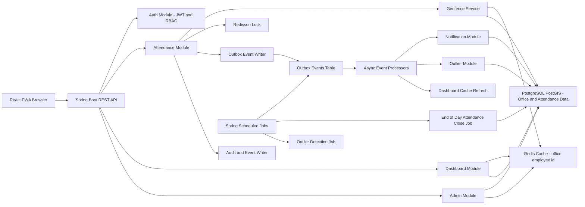

# Architecture

The WFH/WFO Attendance Tracking application is a **modular monolith**: one deployable Spring Boot application with clear domain package boundaries and a React PWA frontend.

---

## High-Level Architecture Diagram



---

## Architecture Decisions

| Decision | Rationale |
|----------|-----------|
| **Modular monolith** | Single deployable unit for MVP; clear package boundaries; ACID transactions across attendance + outbox + sessions |
| **PostgreSQL/PostGIS as source of truth** | Relational data + spatial geofence queries in one store |
| **Redis for cache and locks** | Fast assigned-office lookup; ephemeral auto-tracking state; distributed lock for concurrent check-in/out |
| **Transactional outbox** | Reliable async side effects without Kafka infrastructure in MVP |
| **Scheduled jobs** | EOD day close and outbox polling with retry |
| **Async processors** | Classification, outlier detection, notifications, dashboard cache refresh run off the request thread |

---

## Backend Modules

| Module | Package area | Responsibility |
|--------|--------------|----------------|
| **auth** | `auth` | JWT authentication, login rate limiting |
| **employee** / **team** | `employee` | Employee and team domain, admin CRUD |
| **attendance** | `attendance` | Check-in/out, location signals, sessions, daily summaries, EOD scheduler |
| **geofence** | `geofence` | Assigned-office geofence evaluation (PostGIS) |
| **office** | `office` | Office locations, employee office assignment, Redis cache |
| **policy** | `policy` | Team attendance policies (`required_wfo_minutes`, check-in times) |
| **dashboard** | `dashboard` | Employee, Manager, Leadership, Admin aggregated APIs |
| **outlier** | `outlier` | Rule-based anomaly detection (Strategy pattern) |
| **notification** | `notification` | In-app notifications |
| **outbox** | `outbox` | Transactional outbox + async processors + poller |
| **audit** | `audit` | Audit trail for admin actions |
| **demo** | `demo` | CSV + deterministic demo seed |
| **common** / **config** | `common`, `config` | Shared DTOs, adapters, security, Redis/Redisson, pagination |

---

## Component Responsibility Table

| Component | Responsibility |
|-----------|----------------|
| React PWA | User interface, location capture, dashboards, manual check-in/out |
| Spring Boot API | Business logic, REST endpoints, JWT security |
| PostgreSQL/PostGIS | Source of truth; geofence storage and spatial queries |
| Redis | Cache assigned office and dashboard summaries; auto-tracking state; login rate limits |
| Redisson | Distributed locks (`attendance:events:{employeeId}:{date}`) for duplicate prevention |
| Outbox | Reliable async processing after attendance writes |
| Scheduled Jobs | EOD close (cron), outbox poll (fixed delay), stale event recovery |
| Dashboard Module | Employee, manager, leadership aggregated views |
| Notification Module | In-app alerts to employees and managers |
| Outlier Module | Attendance anomaly detection and alerting |

---

## Data Ownership

| Store / Table | Role |
|---------------|------|
| **PostgreSQL** | Employees, offices, policies, attendance records, sessions, events, outliers, notifications, outbox |
| **`attendance_events`** | Immutable audit of all attendance actions |
| **`attendance_sessions`** | Logical work sessions (WFO/WFH, open/closed, session mode) |
| **`attendance_records`** | One daily summary row per employee per date for fast dashboard queries |
| **Redis** | Performance cache and ephemeral state only — not source of truth |

Dashboards read **`attendance_records`** for KPIs and trends. Drill-down uses **`attendance_sessions`** and **`attendance_events`**.

---

## Office Assignment Model

### MVP (implemented)

- Each employee has **exactly one assigned office**: `employees.assigned_office_location_id` → `office_locations.id`.
- All geofence validation uses **only** the assigned office.
- Demo: `employee@demo.com` → **EY Bengaluru - Ecospace** (12.9262, 77.6811, 500 m radius).

### Future extension

Multiple offices per employee via `employee_office_assignments` (`employee_id`, `office_location_id`, `is_primary`, `active`).

---

## Redis Usage

### Assigned office cache

| Item | Value |
|------|-------|
| Key pattern | `office:employee:{employeeId}` |
| Cached fields | `officeLocationId`, `officeName`, `address`, `latitude`, `longitude`, `radiusMeters`, `active` |
| TTL | **900 seconds** (15 min) — `app.cache.employee-office-ttl-seconds` |
| Flow | Redis → on miss load PostgreSQL → store with TTL → use for geofence |
| Invalidation | Employee office update; office create/update/delete (evicts affected employees) |

### Auto-tracking session state

| Item | Value |
|------|-------|
| Key pattern | `attendance:auto:session:{employeeId}:{date}` |
| Purpose | Inside/outside since timestamps, WFH prompt dismissed flag |
| TTL | 24 hours |

### Dashboard cache

| Key pattern | Purpose |
|-------------|---------|
| `manager:dashboard:{managerId}:{date}` | Manager dashboard summary |
| `leadership:dashboard:{date}` | Leadership dashboard summary |

Evicted by `DashboardCacheRefreshProcessor` after classification completes. TTL: **60 seconds** default.

### Distributed locks (Redisson)

| Key pattern | Purpose |
|-------------|---------|
| `attendance:events:{employeeId}:{date}` | Prevent duplicate concurrent check-in/out for same employee/date |

### Login rate limiting

| Key pattern | Purpose |
|-------------|---------|
| `auth:login:attempts:{email}` | Track failed login attempts (max 5 per 15 min) |

PostgreSQL/PostGIS remains authoritative if cache is stale or evicted.

---

## Attendance Write Path

```
Client (location signal / check-in / check-out)
        │
        ▼
Redisson lock acquired (attendance:events:{employeeId}:{date})
        │
        ▼
Geofence evaluation (Redis office cache → PostGIS)
        │
        ▼
Write attendance_event + attendance_session + attendance_record (transaction)
        │
        ▼
Enqueue outbox_event (same transaction)
        │
        ▼
Return API response to client
        │
        ▼ (async, ~5s poll interval)
OutboxPoller → processors (classification, outlier, notification, cache refresh)
```

---

## Async Outbox Processing

Write path returns quickly; classification and side effects run asynchronously.

1. Check-in/out saved in the **same database transaction** as the outbox event.
2. `@Scheduled` poller (`OutboxPoller`) claims pending events (`FOR UPDATE SKIP LOCKED`).
3. Events processed on a dedicated thread pool executor.

### Processors

| Processor | Trigger | Action |
|-----------|---------|--------|
| **AttendanceClassificationProcessor** | Check-in/out events | Final mode, late flag, office distance |
| **OutlierDetectionProcessor** | Classification completed | Run outlier rules |
| **NotificationProcessor** | Check-in/out, outliers | Create in-app notifications |
| **DashboardCacheRefreshProcessor** | Classification completed | Evict Redis dashboard keys |
| **AuditProcessor** | Admin actions | Write audit log entries |

### Outbox poller settings

| Setting | Default |
|---------|---------|
| Poll interval | 5000 ms |
| Batch size | 10 events |
| Max retries | 3 |

---

## Scheduled Jobs

### EOD day close (`DayCloseScheduler`)

| Setting | Default |
|---------|---------|
| Cron | `0 5 0 * * *` (00:05 daily) |
| Target | Previous day's open sessions |
| Close time | 23:59:59 (`app.attendance.day-close.default-close-time`) |

Actions per open record:

- Close session with `SYSTEM_DAY_CLOSE`
- Set status `MISSING_CHECKOUT`
- Create missing-checkout outlier
- Notify employee and manager
- Run outlier detection

### Outbox poller (`OutboxPoller`)

| Setting | Default |
|---------|---------|
| Schedule | Fixed delay 5000 ms |
| Action | Claim and process pending outbox events |

---

## Geofencing (PostGIS)

- GIST indexes on office and attendance geo points.
- Primary evaluation via PostGIS `ST_DWithin` / distance against assigned office coordinates and radius.
- Java distance helpers used for display; database is authoritative for fence decisions.

---

## Role-Based Dashboards

| Role | API | Data source | Highlights |
|------|-----|-------------|------------|
| Employee | `GET /api/employee/dashboard-summary` | `attendance_records` + today session | Assigned office, today mode, office minutes, 30-day trend |
| Manager | `GET /api/manager/dashboard-summary` | Team `attendance_records` | WFO/WFH counts from final daily mode, team table, outliers |
| Leadership | `GET /api/leadership/dashboard` | Aggregated `attendance_records` | Company/team trends, KPIs |
| Admin | `/api/admin/*` | CRUD on employees, offices, policies | Configuration |

WFO/WFH counts use **final daily `attendance_mode`** from `attendance_records` — not HYBRID.

---

## Outlier Detection

Rule-based Strategy pattern (`OutlierRule` implementations):

| Rule | Typical trigger |
|------|-----------------|
| `FrequentLateCheckInRule` | Repeated late arrivals vs policy |
| `FrequentAbsenceRule` | High absence rate |
| `MissingCheckoutRule` | EOD system close without manual checkout |
| `RepeatedSystemDayCloseRule` | Pattern of system day closes |
| `LowWfoAttendanceRule` | Low WFO rate based on final daily mode |

Triggered asynchronously via outbox and synchronously during EOD close.

---

## Timezone Handling

- Backend stores `LocalDateTime` in **UTC** (no timezone offset in DB).
- Frontend `dateTimeUtils.js` appends `Z` when parsing backend datetimes and displays in **browser local timezone** via `Intl.DateTimeFormat`.

---

## API Documentation

- Swagger UI: http://localhost:8080/swagger-ui/index.html
- OpenAPI JSON: http://localhost:8080/v3/api-docs

See [api-design.md](api-design.md) for endpoint reference.

---

## Related Documentation

- [attendance-flow.md](attendance-flow.md) — check-in/check-out behavior
- [project-scope.md](project-scope.md) — in-scope vs out-of-scope
- [tradeoffs.md](tradeoffs.md) — design rationale
- [local-setup.md](local-setup.md) — running locally
