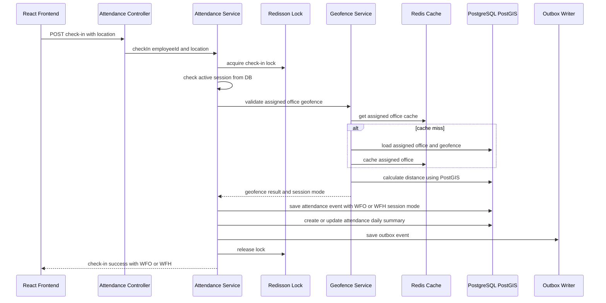
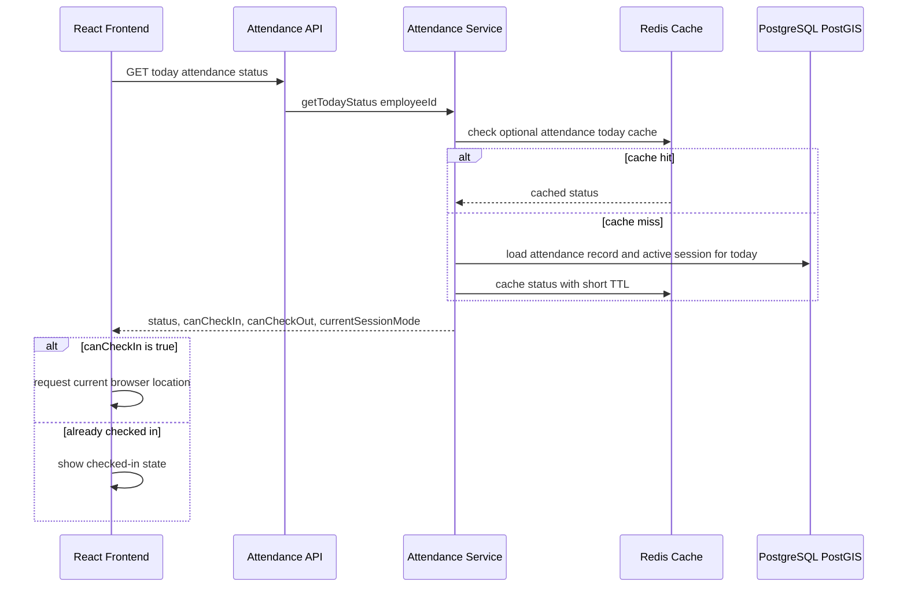
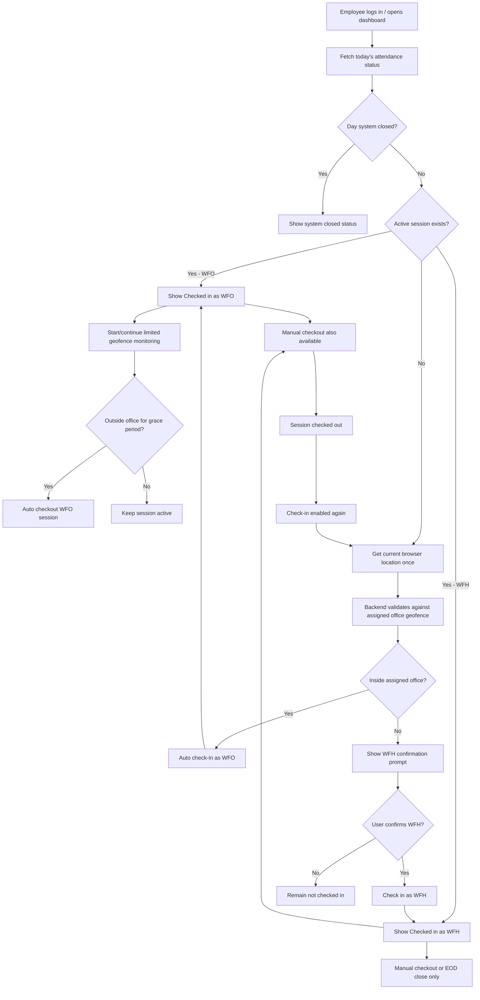
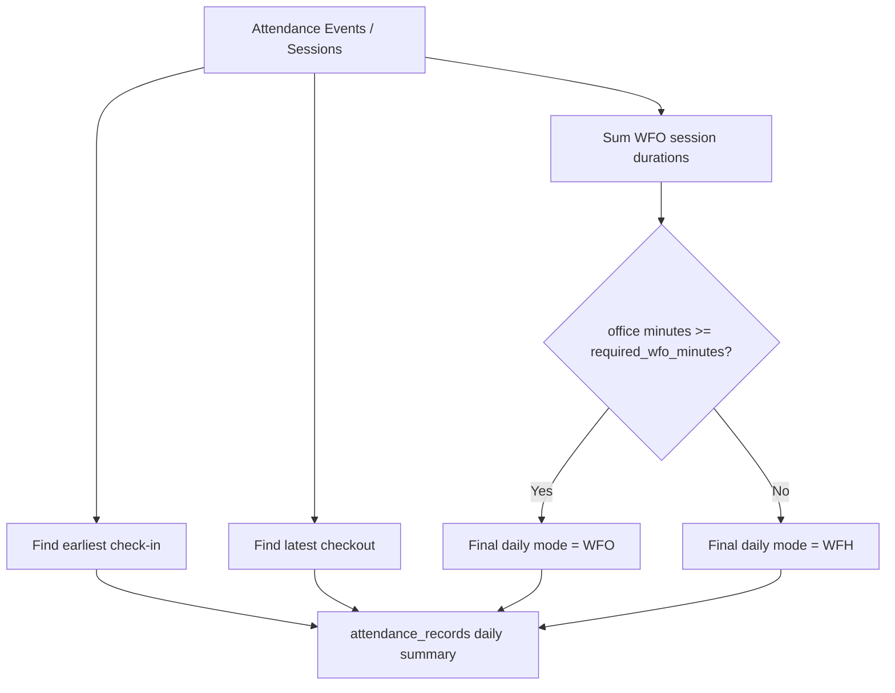

# Attendance Flow

This document describes the **final implemented** employee check-in, check-out, daily summary, and re-check-in behavior.

---

## Overview

Location is used in **two cases only**:

1. **Before check-in** — one `getCurrentPosition()` call decides auto WFO vs WFH confirmation.
2. **After WFO check-in** — limited geofence watcher supports auto-checkout only.

WFH sessions do **not** keep checking location. There is no "Enable auto attendance" toggle and no simulate inside/outside office buttons.

---

## Session Mode vs Daily Mode

Two distinct concepts are stored separately:

| Concept | When decided | Stored in | Values |
|---------|--------------|-----------|--------|
| **Session mode** | Synchronously at each check-in | `attendance_events.session_mode`, `attendance_sessions.session_mode` | WFO or WFH |
| **Daily attendance mode** | After sessions close / EOD | `attendance_records.attendance_mode` | WFO or WFH only (no HYBRID) |

### Session mode rules (backend decides — not frontend)

| Check-in scenario | Session mode |
|-------------------|--------------|
| Inside assigned office geofence (auto or manual) | WFO |
| Outside assigned office geofence after WFH confirmation or manual check-in | WFH |
| Auto WFO check-in | WFO |
| WFH confirmed check-in | WFH |

Multiple sessions on the same day may have different session modes. Manager drill-down uses **final daily mode** from `attendance_records`. Employee session/event history shows **per-session WFO/WFH**.

---

## Check-In Sequence

---

## Dashboard Load / Already Checked-In Flow

**Notes:**

- **DB is the source of truth** for already checked-in status and active sessions.
- Redis today attendance cache (`attendance:today:employeeId:date`) is **optional** for faster dashboard refresh.
- Cache must be evicted or updated on check-in, checkout, auto-checkout, WFH confirmed check-in, and EOD system close.

---

## Employee Flow Diagram

---

## Check-In Rules

### Automatic flow (dashboard open, not checked in)

| Condition | Behavior |
|-----------|----------|
| Inside assigned office geofence | Wait ~15s stability (demo), then **auto check-in as WFO** |
| Outside assigned office geofence | Show **WFH confirmation prompt** — WFH is never silently marked |
| User confirms WFH | Create WFH session via `POST /api/attendance/wfh-check-in` |
| User dismisses prompt | Remain not checked in; manual check-in still available |
| Location permission denied | Show fallback message; manual check-in/out still works |

### Manual check-in

| Condition | Backend classification |
|-----------|------------------------|
| Inside assigned office geofence | **WFO** session — auto-checkout monitoring starts |
| Outside assigned office geofence | **WFH** session — no continuous location monitoring |

Manual check-in uses `POST /api/attendance/check-in` with a location payload. The **backend** classifies session mode from assigned office geofence — the frontend does not decide WFO/WFH.

### Geofence radius

- Each assigned office has a **`radius_meters`** geofence validated via PostGIS `ST_DWithin` and `ST_Distance`.
- **Default for new offices:** 100 meters (configurable by admin between **50–300** meters).
- **EY Bengaluru demo office:** 100 meters.
- Production systems may tune radius based on office campus size, GPS accuracy, and security requirements.

### Stability and GPS quality

- Auto check-in requires continuous inside readings for `checkInStableSeconds` (default **15** demo).
- Auto checkout requires continuous outside readings for `checkoutGraceSeconds` (default **60** demo).
- Readings with poor accuracy (>100 m) or stale timestamps (>120 s) are ignored for auto decisions — WFO is **not** silently recorded when GPS is unreliable.
- Manual WFO check-in inside the geofence is also rejected when accuracy is too poor.
- A **single** outside reading does not trigger auto-checkout.

---

## Checkout Rules

| Session type | Auto-checkout | Manual checkout | EOD close |
|--------------|---------------|-----------------|-----------|
| **WFO** (auto or manual) | Yes — after grace period outside geofence | Always available | Closes open session at 23:59:59 |
| **WFH** | No | Required | Closes open session at 23:59:59 |

### WFO auto-checkout monitoring

- Starts after any WFO check-in (auto or manual).
- Uses `watchPosition` while the app/PWA is open.
- UI shows stable text: *Checked in as WFO* and *Auto-checkout monitoring active*.
- Does **not** repeatedly show "Detecting location" after check-in.
- If outside grace period is met → `AUTO_CHECK_OUT` event, session closed.

### WFH checkout

- No geofence watcher while checked in as WFH.
- UI: *Checked in as WFH* and *Manual checkout required. System will close at end of day if checkout is missed.*
- If user forgets checkout → **EOD system close** at 23:59:59 creates `SYSTEM_DAY_CLOSE` and may raise a missing-checkout outlier.

---

## End-of-Day (EOD) System Close

| Setting | Default |
|---------|---------|
| Close time | **23:59:59** of the attendance date |
| Scheduler cron | `0 5 0 * * *` (00:05 daily, processes previous day) |

The job:

1. Finds open sessions for the target date.
2. Closes them with `SYSTEM_DAY_CLOSE`.
3. Sets daily record status to `MISSING_CHECKOUT` where applicable.
4. Creates missing-checkout outlier and notifications.
5. Triggers outlier detection for affected employees.

---

## Same-Day Re-Check-In

Multiple sessions per day are supported.

| Rule | Behavior |
|------|----------|
| Check-in enabled | When **no** active open session |
| Check-in disabled | While a session is **OPEN** |
| After checkout | Status becomes `CHECKED_OUT`; location evaluation runs again on next dashboard load |
| Inside office after checkout | Auto WFO check-in + WFO watcher |
| Outside office after checkout | WFH confirmation prompt |

---

## Daily Summary Calculation

Daily summaries are stored in **`attendance_records`** (one row per employee per date).

### Field rules

| Field | Rule |
|-------|------|
| `first_check_in_time` | Earliest valid check-in event of the day |
| `final_check_out_time` | Latest valid checkout of the day |
| `total_office_minutes` | Sum of durations of all **WFO sessions only** (open WFO at EOD counts to close time) |
| `attendance_mode` | **Final daily mode**: WFO if `total_office_minutes >= required_wfo_minutes`, else **WFH** |
| `current_session_status` | `NONE`, `OPEN`, or `CLOSED` — reflects active session from DB |
| `status` | e.g. `CHECKED_IN`, `CHECKED_OUT`, `MISSING_CHECKOUT`, `SYSTEM_CLOSED` |

### Event and session storage

| Table | Session mode | Notes |
|-------|--------------|-------|
| `attendance_events` | `session_mode` on each check-in event | Also stores `matched_office_location_id`, `distance_from_office_meters`, `source`, `trigger_mode` |
| `attendance_sessions` | `session_mode` per work session | DB source of truth for active session; status `OPEN`, `CLOSED`, or `SYSTEM_CLOSED` |
| `attendance_records` | `attendance_mode` = final daily WFO/WFH | Separate from per-session mode |

### Important MVP constraints

- **No HYBRID** daily status — dashboards show WFO or WFH only.
- `required_wfo_minutes` is configurable per team in `attendance_policies` (default **180**).
- A later WFH session on the same day does **not** downgrade a day that already met the office-time threshold.
- Times are stored in **UTC**; the frontend displays them in the **browser local timezone**.

---

## Browser / PWA Limitation

Auto-checkout works while the app/PWA is **open** and the browser grants location access.

If the browser/app is closed:

- Auto-checkout cannot run.
- EOD system close closes any still-open session.
- A `SYSTEM_DAY_CLOSE` event is recorded.
- A missing-checkout outlier may be created.

There is **no** true background location tracking when the tab or PWA is closed.

---

## UI States (Employee Dashboard)

| State | Primary label | Secondary hint |
|-------|---------------|----------------|
| Not checked in | Detecting location / geofence result | WFH prompt if outside |
| WFO checked in | Checked in as WFO | Auto-checkout monitoring active |
| WFO leaving office | Outside office — auto checkout pending | Grace countdown |
| WFH checked in | Checked in as WFH | Manual checkout required; EOD close if missed |
| Checked out | Checked out — check-in available | — |
| Day closed | System closed | — |

---

## API Endpoints Used

| Action | Endpoint |
|--------|----------|
| Today status | `GET /api/attendance/me/today` |
| Location signal | `POST /api/attendance/location-signal` |
| Manual check-in | `POST /api/attendance/check-in` |
| WFH confirm | `POST /api/attendance/wfh-check-in` |
| Dismiss WFH prompt | `POST /api/attendance/dismiss-wfh-prompt` |
| Manual checkout | `POST /api/attendance/check-out` |

See [api-design.md](api-design.md) for request/response details.

---

## Related Documentation

- [architecture.md](architecture.md) — Redis, outbox, schedulers
- [tradeoffs.md](tradeoffs.md) — why WFO auto vs WFH confirm, auto-checkout scope
- [local-setup.md](local-setup.md) — testing geolocation locally
