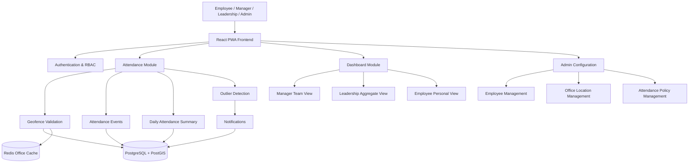

# Project Scope

This document defines what is included in the WFH/WFO Attendance Tracking MVP, what is explicitly excluded, and planned future enhancements.

---

## In Scope (MVP)

### Authentication and access

- Employee login with JWT
- Role-based access control: **EMPLOYEE**, **MANAGER**, **LEADERSHIP**, **ADMIN**
- Login rate limiting (Redis-backed)

### Attendance core

- Employee attendance check-in and check-out
- Geo-fencing based WFO/WFH classification against **one assigned office per employee**
- **Auto WFO check-in** when inside assigned office geofence (with stability period)
- **WFH confirmation prompt** when outside office (WFH is never silently marked)
- **Manual check-in** with backend geofence classification (inside → WFO, outside → WFH)
- **Auto-checkout monitoring** for active **WFO** sessions only
- **Manual checkout** for all active sessions
- **Same-day multiple sessions** and re-check-in after checkout
- **EOD system close** for open sessions missed at day end (23:59:59 default)

### Data model

- **`attendance_events`** — immutable audit trail (check-in, checkout, geofence enter/exit, system day close)
- **`attendance_sessions`** — logical work sessions (WFO/WFH, open/closed)
- **`attendance_records`** — one daily summary row per employee per date

### Daily summary

- Final daily mode: **WFO** or **WFH only** (no HYBRID)
- Based on `total_office_minutes` vs team `required_wfo_minutes`
- Times stored in UTC; displayed in browser local timezone

### Infrastructure and performance

- PostgreSQL + PostGIS as source of truth
- **Redis cache** for assigned office lookup (`office:employee:{id}`)
- **Redisson distributed locks** to prevent duplicate concurrent check-in/out
- **Transactional outbox** for reliable async processing
- **Scheduled jobs** for outbox polling and EOD day close

### Dashboards

- **Employee dashboard** — personal KPIs, today status, assigned office, trends
- **Manager dashboard** — team attendance, WFO/WFH counts, outliers
- **Leadership dashboard** — organization-wide aggregates

### Admin

- Employee management (including assigned office)
- Office location management (geofence center + radius)
- Attendance policy management (`required_wfo_minutes`, check-in times, late threshold)

### Outliers and notifications

- Rule-based outlier detection (Strategy pattern)
- In-app notifications for managers and employees

### API and documentation

- REST APIs with standard `ApiResponse<T>` wrapper
- **Pagination** for list APIs (default page 0, size 20, max 100)
- Swagger/OpenAPI documentation

---

## Out of Scope (MVP)

| Item | Reason |
|------|--------|
| Multiple offices per employee | Simplified geofence rules; future `employee_office_assignments` |
| Native mobile app | PWA covers assignment evaluation scope |
| True background location when app/browser is closed | Browser/PWA platform limitation |
| Corporate Wi-Fi / badge integration | Requires enterprise infrastructure |
| Payroll / HRMS integration | Beyond attendance tracking MVP |
| Full production SSO | Demo JWT auth for evaluators |
| Advanced fraud prevention | Basic audit + outlier rules only; no MDM/device integrity |
| Email / SMS / push notifications | In-app only |
| HYBRID daily status on dashboards | WFO/WFH only for reporting simplicity |
| "Enable auto attendance" toggle | Auto flow is always active on Employee Dashboard |
| Simulate inside/outside office UI | Removed; uses real browser geolocation |

---

## Future Enhancements

1. **Multiple office assignment** — `employee_office_assignments` table with primary office flag
2. **Native mobile app** — OS-level background geofencing and offline queue
3. **Corporate Wi-Fi / badge validation** — additional presence signals beyond GPS
4. **Kafka / event streaming** — replace or supplement in-process outbox poller at scale
5. **Enterprise SSO** — OIDC / SAML integration
6. **Advanced analytics** — predictive attendance, team capacity planning
7. **HRMS integration** — export daily summaries to payroll systems
8. **Richer daily labels** — optional HYBRID or split-day classification
9. **Real-time dashboards** — WebSocket/SSE instead of polling
10. **Enhanced fraud prevention** — Wi-Fi fingerprinting, MDM attestation, anomaly ML

---

## High-Level Scope Diagram

---

## Related Documentation

- [architecture.md](architecture.md) — technical architecture
- [attendance-flow.md](attendance-flow.md) — check-in/check-out behavior
- [tradeoffs.md](tradeoffs.md) — design rationale
- [assumptions.md](assumptions.md) — product assumptions
